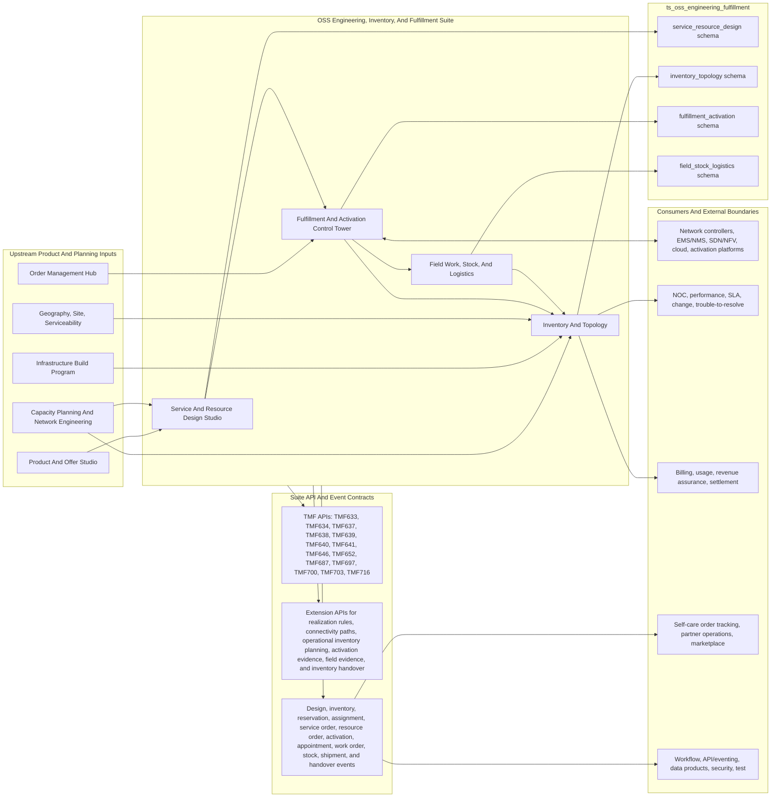
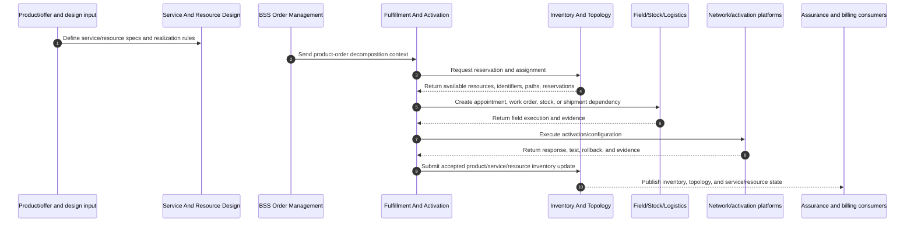
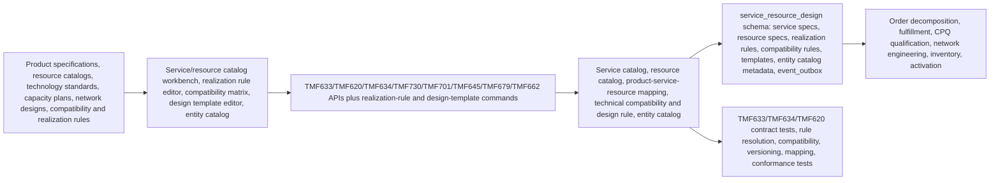
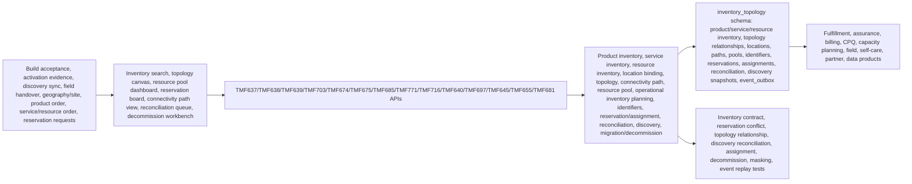
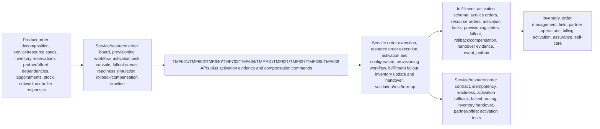
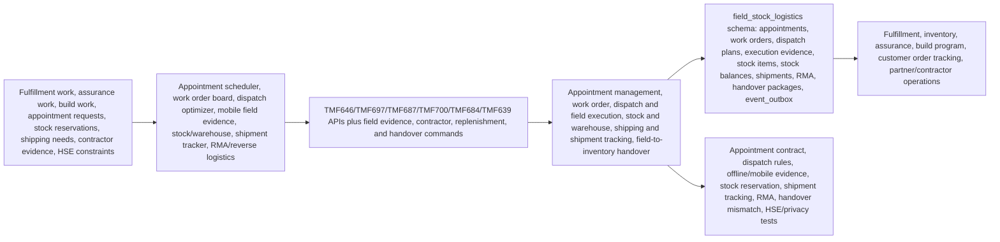

# OSS Engineering, Inventory, And Fulfillment Architecture Diagrams

Reviewed: 2026-06-14

## Purpose

Use these diagrams when building the OSS Engineering, Inventory, And Fulfillment suite and its apps. They make the ownership split between service/resource design, inventory/topology, fulfillment/activation, and field/stock/logistics explicit enough for implementation planning.

Primary sources:

- [Implementation File Usage Guide](implementation-file-usage-guide.md)
- [Tech And UI Guidance](tech-and-ui-guidance.md)
- [Data Model](data-model.md)
- [Journey Coverage](journey-coverage.md)
- App `implementation-file-usage.md`, `README.md`, `modules-and-features.md`, `personas-and-user-journeys.md`, and `features/` detail packs
- [TMF API To DDL Traceability Matrix](../tmf-api-to-ddl-traceability-matrix.md)
- `database/postgres/suites/ts_oss_engineering_fulfillment/`

## Suite Architecture

## Suite Build Flow

## App Architecture: Service And Resource Design Studio

## App Architecture: Inventory And Topology

## App Architecture: Fulfillment And Activation Control Tower

## App Architecture: Field Work, Stock, And Logistics

## Build Use

Use these diagrams to keep execution ownership clean: fulfillment owns service/resource order execution and activation evidence; inventory owns accepted product/service/resource state; field owns appointment, work order, stock, shipment, and field evidence; design studio owns service/resource definitions and realization rules.
