# API-First Telecom Product Suite Architecture

Visual HTML version: [api-first-architecture.html](visuals/api-first-architecture.html)

## Architecture Intent

Build the telecom product suite as a headless, API-first product platform.

Principles:

- Every business capability is exposed through product APIs.
- TM Forum Open APIs are the primary external contract style where a TMF contract exists.
- Our own web/mobile/operator applications consume the same API layer as external consumers.
- UIs never access databases directly.
- Apps/modules own their operational data.
- Cross-app interaction happens through APIs, events, workflow, and governed integration contracts.
- Technology choices are intentionally deferred.

## View 1: API-First Logical Architecture

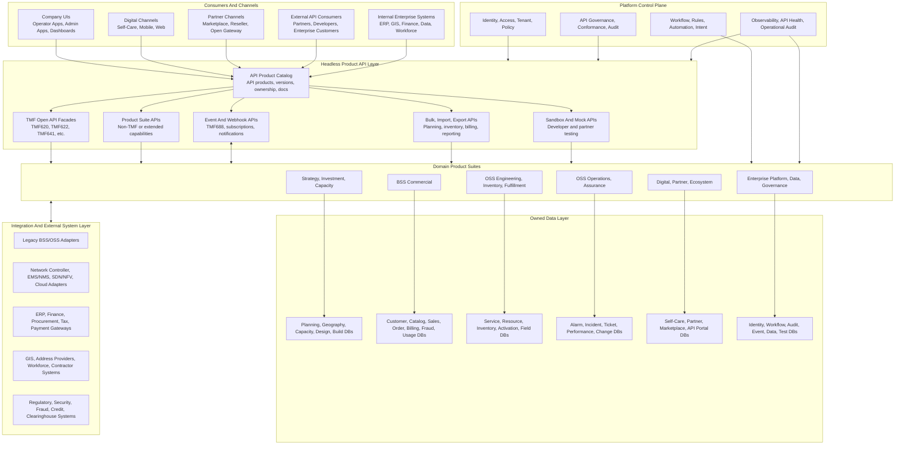

## View 2: API Exposure Model

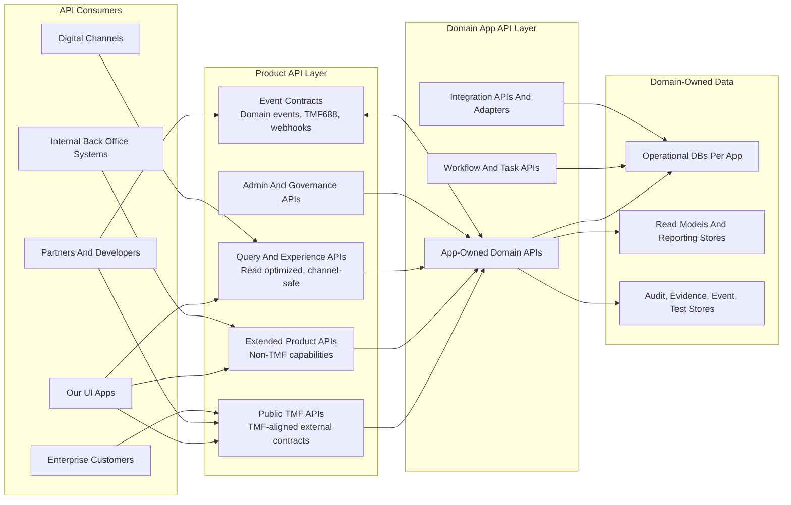

API rules:

- TMF APIs are product contracts, not database wrappers.
- Extended APIs are allowed when TMF does not cover a capability, but they must be cataloged and governed.
- UIs use the same API contracts as external consumers unless there is a clear experience-query need.
- Query APIs can compose across domains, but they should not become systems of record.
- Events are first-class product contracts, especially for order, inventory, assurance, billing, and partner flows.

## View 3: Product Suite And App Topology

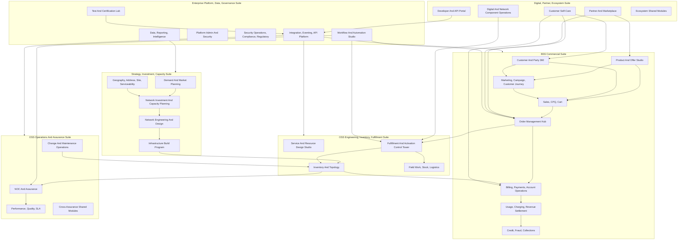

## View 4: Logical Databases And System Of Record Boundaries

Detailed entity-level mastership is defined in [Data Mastery And Entity Ownership](data-mastery-entity-ownership.md).
Recommended database instance and logical database setup is defined in [Recommended Database Setup](recommended-database-setup.md). The view below groups logical data by suite-level domain; the database setup document defines the recommended 9 runtime database instances.

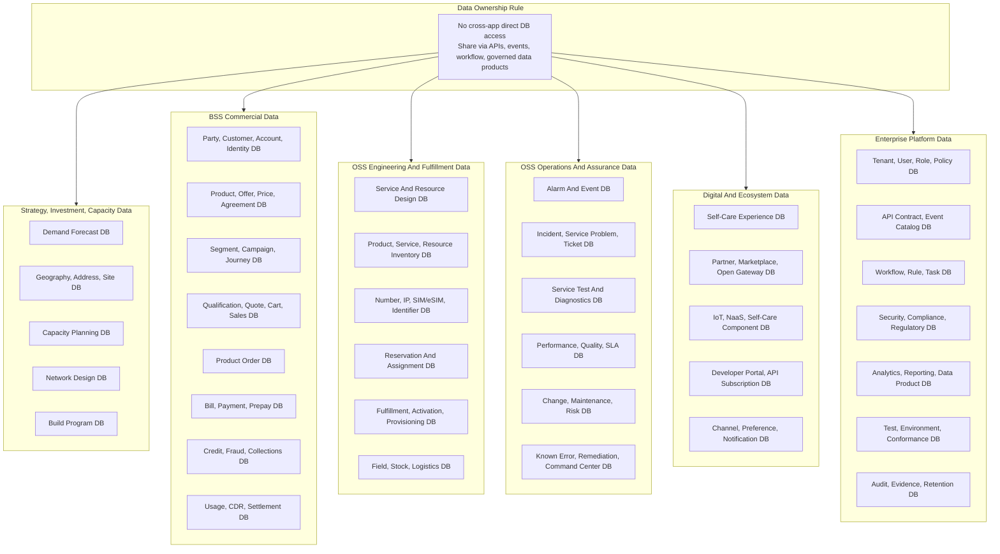

Database rules:

- These are logical databases grouped by suite-level data domain. The recommended physical/runtime grouping is the 9-instance setup in the database setup document.
- Each app owns writes to its operational store.
- Other apps read through APIs, subscribed events, approved read models, or data products.
- Reporting stores must not become hidden operational masters.
- Customer, inventory, order, billing, assurance, security, and regulatory records need explicit ownership and retention rules.

## View 5: API And Event Interaction Across Major Operating Loops

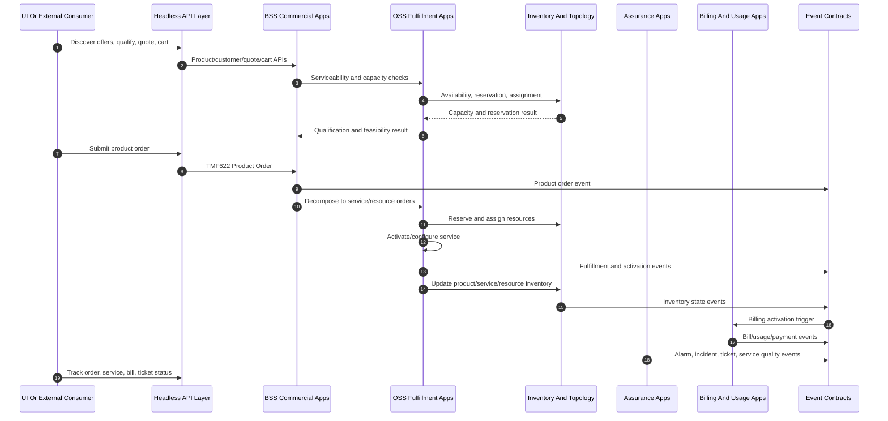

## View 6: Suite Module Maps

These module maps are the architecture decomposition behind the diagrams. Each module should eventually map to APIs, events, owned data, UI surfaces, and backlog epics.

### Strategy, Investment, And Capacity

| App | High-Level Modules |
| --- | --- |
| Demand And Market Planning | Market Segmentation, Demand Forecasting, Revenue And Margin Scenario, Demand-To-Capacity Gap |
| Geography, Address, Site, And Serviceability | Geographic Master Data, Service Area And Coverage, Map And Spatial Visualization, Site Readiness And Eligibility |
| Network Investment And Capacity Planning | Capacity Model, Forecast And Exhaustion, Investment Scenario, Future Capacity Reservation |
| Network Engineering And Design | High-Level Network Design, Low-Level Design And Bill Of Materials, Design Rules And Validation, Planned Topology |
| Infrastructure Build Program | Build Portfolio, Permits/Dependencies/Readiness, Vendor Work Package, Build-To-Inventory Reconciliation |

### BSS Commercial

| App | High-Level Modules |
| --- | --- |
| Customer And Party 360 | Party Master, Customer Profile, Account Hierarchy, Identity/Access/Consent, Interaction/Communication/Document, Customer Care Case And Complaint, Loyalty And Engagement |
| Product And Offer Studio | Product Catalog, Pricing/Promotion/Discount, Product Configuration, Agreement And Contract, Catalog Governance |
| Marketing, Campaign, And Customer Journey | Segment And Audience, Campaign Planning And Offer Targeting, Journey Orchestration, Retention And Loyalty Treatment, Contact Policy And Consent Enforcement |
| Sales, CPQ, And Cart | Product Offering Qualification, Recommendation And Guided Selling, Quote Management, Shopping Cart, Sales Opportunity, Channel/Dealer/Commission Support |
| Order Management Hub | Product Order Capture, Order Decomposition, Order Orchestration And Jeopardy, Order Fallout And Exception |
| Billing, Payments, And Account Operations | Billing Account, Customer Bill, Payment And Payment Method, Prepay Balance, Collections And Adjustment |
| Credit, Fraud, And Collections | Credit Risk And Eligibility, Fraud Detection And Case Management, Collections Strategy, Service Restriction And Reconnection, Dispute And Recovery |
| Usage, Charging, And Revenue Settlement | Usage Ingestion And Mediation, Usage Consumption, Revenue Assurance, Partner Revenue Sharing, Rating/Charging/Tax Integration, Roaming/Interconnect/Wholesale Settlement |

### OSS Engineering, Inventory, And Fulfillment

| App | High-Level Modules |
| --- | --- |
| Service And Resource Design Studio | Service Catalog, Resource Catalog, Product-Service-Resource Mapping, Technical Compatibility And Design Rule, Entity Catalog |
| Inventory And Topology | Product Inventory, Service Inventory, Resource Inventory, Inventory Location Management, Topology And Relationship, Inventory Connectivity And Path Management, Resource Pool And Capacity, Operational Inventory Planning, Identifier Resources, Reservation And Assignment, Inventory Reconciliation, Network Discovery And Sync, Migration And Decommissioning |
| Fulfillment And Activation Control Tower | Service Order Execution, Resource Order Execution, Activation And Configuration, Provisioning Workflow, Fulfillment Fallout, Inventory Update And Handover |
| Field Work, Stock, And Logistics | Appointment Management, Work Order, Dispatch And Field Execution, Stock And Warehouse, Shipping And Shipment Tracking, Field-To-Inventory Handover |

### OSS Operations And Assurance

| App | High-Level Modules |
| --- | --- |
| NOC And Assurance | Alarm Intake And Normalization, Correlation And Impact Analysis, Incident Management, Service Problem Management, Trouble Ticket Management, Service Test And Diagnostics, Remediation And Dispatch |
| Performance, Quality, And SLA | Performance Collection, Threshold And Alerting, Service Quality, SLA And Enterprise Operations, Quality Analytics |
| Change And Maintenance Operations | Change Record, Maintenance Window, Risk And Impact, Change Execution, Customer And Stakeholder Communication |
| Cross-Assurance Shared Modules | Knowledge And Known Error, Assurance Automation, Operational Command Center |

### Digital, Partner, And Ecosystem

| App | High-Level Modules |
| --- | --- |
| Customer Self-Care | Customer Profile And Access, Product And Service View, Digital Sales And Change, Order And Appointment Tracking, Billing/Payment/Usage, Support And Trouble Ticket |
| Partner And Marketplace | Partner Onboarding, Partner Catalog And Offer, Partner Ordering, Marketplace Operations, Partner Usage And Settlement, Partner Support |
| Digital And Network Component Operations | Self-Care Component Operations, NaaS Component Operations, IoT Agent And Device Operations, IoT Service Operations |
| Developer And API Portal | API Catalog, Developer Onboarding And Subscription, Sandbox And Mock API, API Analytics And Health, API Governance And Conformance |
| Ecosystem Shared Modules | Channel Experience, Notification And Preference |

### Enterprise Platform, Data, And Governance

| App | High-Level Modules |
| --- | --- |
| Integration, Eventing, And API Platform | API Gateway, OpenAPI Contract Registry, Event Catalog And Subscription, Integration Adapter, Notification Delivery |
| Platform Admin And Security | Tenant And Environment Administration, Identity And Access, Policy And Authorization, Audit/Compliance/Privacy, Secrets And Platform Configuration |
| Security Operations, Compliance, And Regulatory | Security Monitoring And Incident, Compliance Control, Regulatory Operations, Data Retention And Legal Hold, Business Continuity And Operational Resilience |
| Workflow And Automation Studio | Process Definition, Rules And Decision, Work Queue And Task, Automation And Intent, Configuration And Extension Studio |
| Data, Reporting, And Intelligence | Operational Data Platform, Master Data And Reference Data, KPI And Dashboard, Analytics And AI Insight, Reporting And Regulatory |
| Test And Certification Lab | Test Case Management, Test Environment, Test Data, Test Scenario And Execution, Test Result And Defect, TMF Conformance |

## View 7: Detailed Suite Module Diagrams

### Strategy, Investment, And Capacity Module Diagram

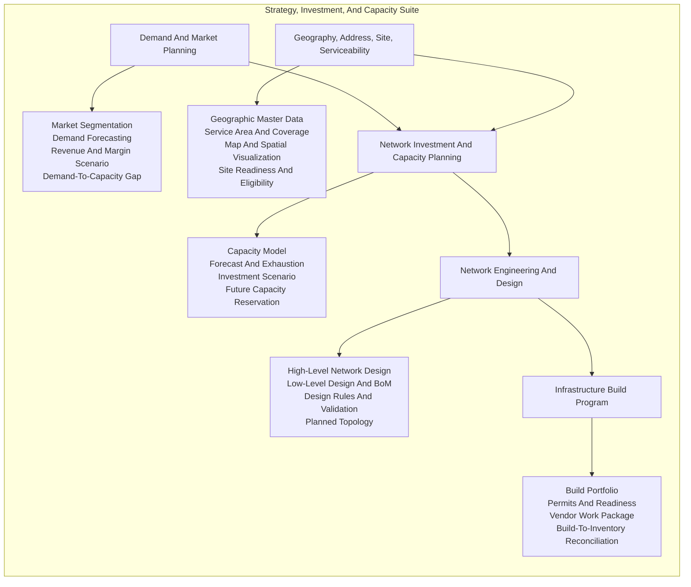

### BSS Commercial Module Diagram

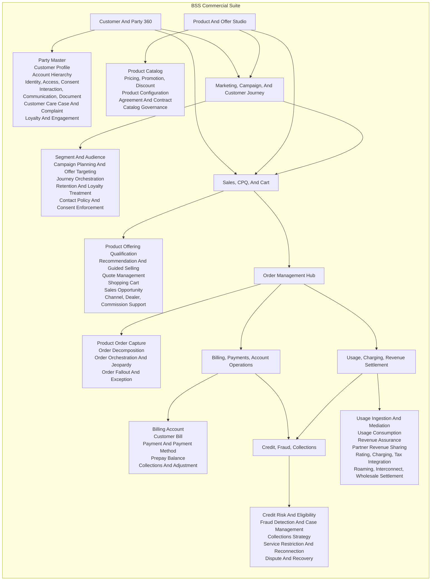

### OSS Engineering, Inventory, And Fulfillment Module Diagram

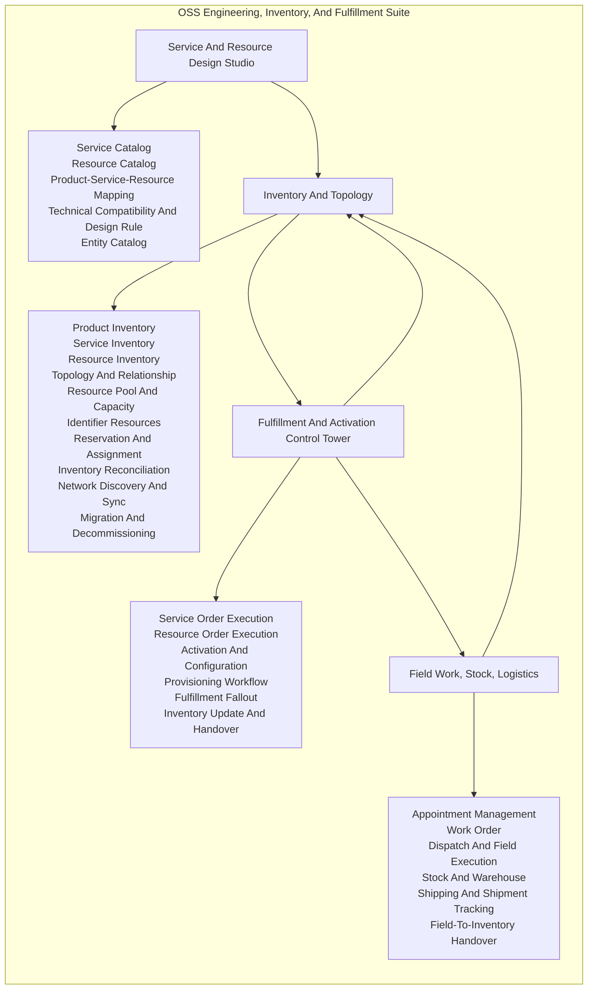

### OSS Operations And Assurance Module Diagram

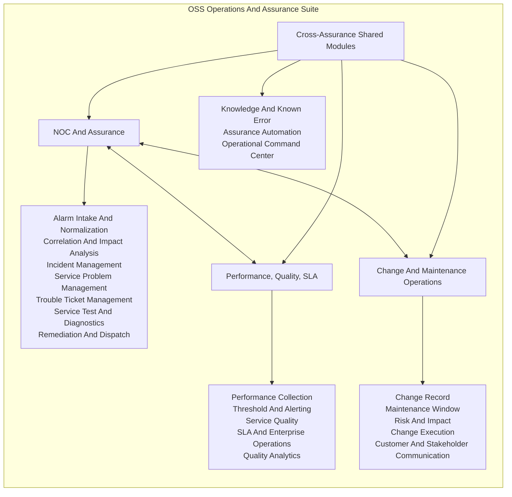

### Digital, Partner, And Ecosystem Module Diagram

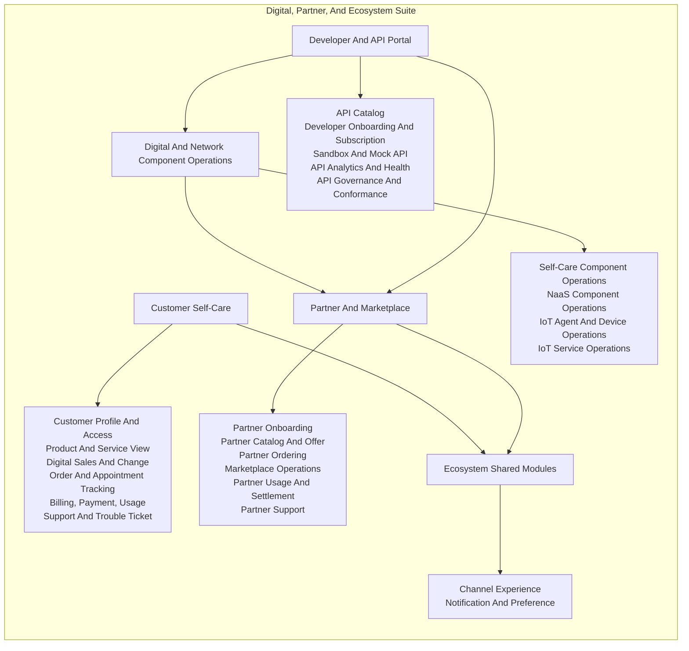

### Enterprise Platform, Data, And Governance Module Diagram

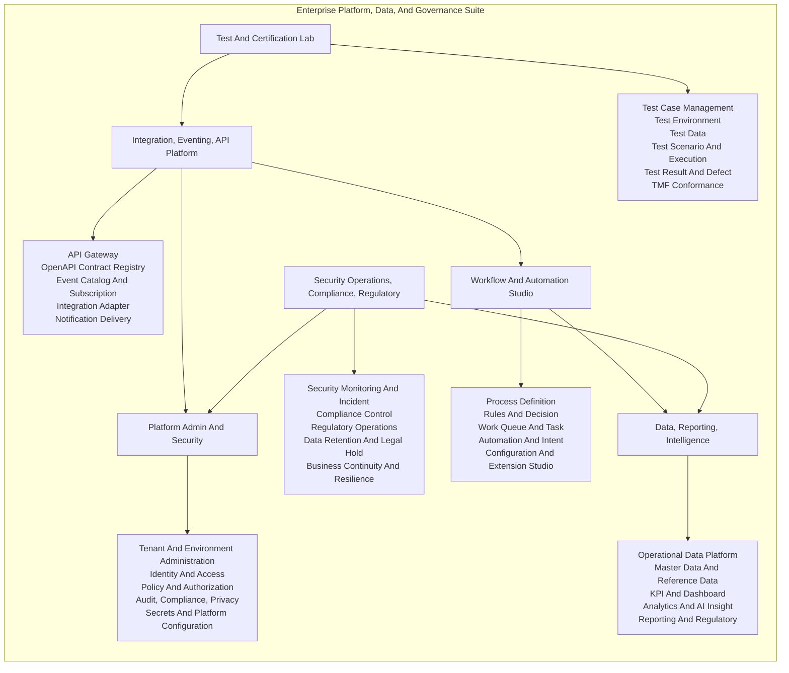

## View 8: API Ownership By Suite

| Suite | API Ownership Role |
| --- | --- |
| Strategy, Investment, Capacity | Planning APIs, serviceability APIs, capacity APIs, build program APIs, geography/site/location APIs |
| BSS Commercial | Customer, catalog, marketing, journey, CPQ, order, billing, payment, usage, fraud, revenue APIs |
| OSS Engineering, Inventory, Fulfillment | Service/resource catalog, inventory, reservation, activation, field, logistics APIs |
| OSS Operations And Assurance | Alarm, incident, ticket, service test, performance, service quality, change APIs |
| Digital, Partner, Ecosystem | Self-care, partner, marketplace, Open Gateway, component-suite, developer portal APIs |
| Enterprise Platform, Data, Governance | Identity, event, workflow, governance, conformance, audit, data, reporting APIs |

## View 9: UI Architecture

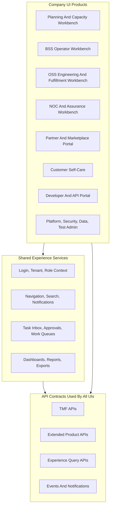

UI rules:

- Every UI is optional from an integration standpoint; APIs are the product core.
- Operator UIs may use query APIs for usability, but writes still go through app-owned command APIs.
- External consumers should be able to perform headless workflows without requiring our UI.
- UI modules should not become hidden business logic owners.

## Questions To Confirm Before Next Architecture Iteration

1. Should the product be designed for a single telecom operator first, or as a multi-tenant product for many telecom companies from day one?
2. Which first operating domain should we optimize for: mobile, fiber broadband, enterprise connectivity, IoT, NaaS, or a blended operator?
3. Do we want external consumers to see only strict TMF APIs, or can they also consume our extended product APIs where TMF does not cover the capability?
4. Should partner/Open Gateway APIs be a first-release requirement or a later ecosystem phase?
5. Do we want billing/charging/rating to be native in our suite, or should we design billing operations while integrating with external charging/rating engines?
6. Should the first MVP include a complete BSS-to-OSS flow, or should we start with the planning/inventory backbone as the first product slice?
