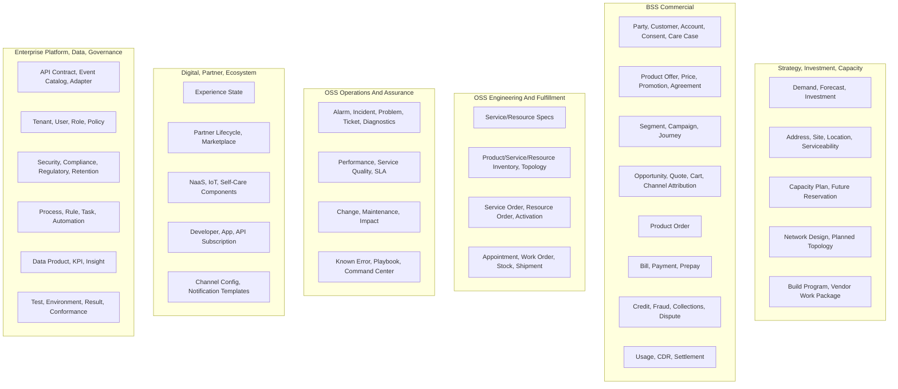

# Data Mastery And Entity Ownership

Reviewed: 2026-06-06

## Purpose

This document defines which suite and app masters each major telecom business entity. It is intended to prevent duplicate systems of record as we build the OSS, BSS, digital, partner, planning, and platform product suites.

The goal is not to say that only one app can use an entity. Many apps will read, cache, project, snapshot, enrich, or reference the same entity. The goal is to make clear which app has authority to create, change, retire, validate, and publish the canonical state for that entity.

## Source Basis

The ownership decisions use the following sources:

- TM Forum Information Framework (SID): https://www.tmforum.org/oda/information-framework-sid/
- TM Forum ODA Components and Canvas: https://www.tmforum.org/oda/implementation/components-canvas/
- Downloaded TMF Open API specs: [references/tmforum-open-apis](../references/tmforum-open-apis/README.md)
- App to TMF API coverage index: [api-coverage-index.md](suite-details/api-coverage-index.md)
- API-first architecture data boundary view: [api-first-product-suite-architecture.md](api-first-product-suite-architecture.md)
- Recommended database setup: [recommended-database-setup.md](recommended-database-setup.md)
- App detail data ownership notes: [suite-details](suite-details/README.md)

TM Forum SID is used as the conceptual information-domain guide. TMF Open APIs are used as the operational contract guide. Our app boundaries are used to decide where lifecycle authority should live in this product suite.

## Decision Method

Mastership was assigned step by step using these rules:

1. **Start with the TMF information domain.** Customer-domain entities should not be mastered by inventory apps, resource entities should not be mastered by customer apps, and so on.
2. **Find the TMF API that owns the lifecycle contract.** For example, TMF620 indicates product catalog lifecycle, TMF637 indicates installed product inventory, and TMF622 indicates product order lifecycle.
3. **Assign mastership to the app that performs the authoritative business operation.** The app that displays an entity is not necessarily the master.
4. **Separate definition, transaction, and instance data.** A product specification, a product order, and an installed product are different entities with different masters.
5. **Separate operational mastership from analytical or experience projections.** Digital, reporting, and dashboards can own experience state or data products, but they should not become shadow systems of record.
6. **Separate external system authority from internal product authority.** For rating, tax, ERP, payment gateways, SIEM/SOAR, workforce, GIS providers, and network controllers, our app may master adapter state or product context while the external system remains authoritative for its domain.
7. **Prefer one master, many consumers.** If two apps need to update the same entity, split the entity into smaller lifecycle-owned records or introduce workflow around the owning app.

## Mastery Principles

- A master app owns canonical IDs, lifecycle state, validation rules, write APIs, change events, and audit history for its entities.
- Consumer apps store foreign references, snapshots, projections, or derived summaries when needed for performance or historical evidence.
- A transaction app can snapshot external master data at transaction time. For example, Quote can snapshot customer, offer, price, and serviceability data without mastering those records.
- A domain event from the master is the preferred way for consumers to update projections.
- Data corrections must happen in the master app, then flow outward.
- Analytics and AI apps may derive data products and insights, but they do not overwrite operational master records.
- UIs never write directly to another app database. UIs call the owning app's APIs.

## Mastership At A Glance

## Entity Mastership Matrix

### Strategy, Geography, Capacity, And Build

| Entity Family | Master Suite | Master App | TMF API Basis | Notes And Major Consumers |
| --- | --- | --- | --- | --- |
| Market segment assumptions | Strategy, Investment, Capacity | Demand And Market Planning | TMF620, TMF629 | References product and customer domains; consumed by capacity, marketing, product, and finance planning. |
| Demand forecast | Strategy, Investment, Capacity | Demand And Market Planning | TMF635, TMF677, TMF637, TMF678 | Derived from usage, product inventory, order, and billing actuals; does not master those actuals. |
| Revenue and margin scenario | Strategy, Investment, Capacity | Demand And Market Planning | TMF678, TMF696 | Planning scenario, not financial ledger. Finance/ERP remains external where applicable. |
| Demand-to-capacity gap | Strategy, Investment, Capacity | Demand And Market Planning | TMF639, TMF685, TMF716, TMF771 | Consumed by capacity planning, design, and build. |
| Geographic address | Strategy, Investment, Capacity | Geography, Address, Site, And Serviceability | TMF673 | Used by customer, serviceability, field, inventory, assurance, and billing. |
| Geographic site | Strategy, Investment, Capacity | Geography, Address, Site, And Serviceability | TMF674 | Includes buildings, towers, cabinets, exchanges, data centers, edge nodes, and customer premises. |
| Geographic location | Strategy, Investment, Capacity | Geography, Address, Site, And Serviceability | TMF675 | Used for maps, topology, field dispatch, incidents, coverage, and serviceability. |
| Service area, coverage, territory | Strategy, Investment, Capacity | Geography, Address, Site, And Serviceability | TMF673, TMF674, TMF675 | A local extension around TMF geography APIs. |
| Serviceability decision/rule | Strategy, Investment, Capacity | Geography, Address, Site, And Serviceability | TMF645, TMF679 | CPQ consumes decisions; catalog and inventory provide inputs. |
| Capacity model and planning threshold | Strategy, Investment, Capacity | Network Investment And Capacity Planning | TMF634, TMF639, TMF685, TMF771 | Inventory masters actual resources; capacity app masters planning models. |
| Capacity exhaustion forecast | Strategy, Investment, Capacity | Network Investment And Capacity Planning | TMF771, TMF677, TMF685 | Consumed by investment, engineering, assurance, and fulfillment. |
| Investment scenario | Strategy, Investment, Capacity | Network Investment And Capacity Planning | TMF696, TMF730 | Planning decision record, not procurement or GL record. |
| Future capacity reservation | Strategy, Investment, Capacity | Network Investment And Capacity Planning | TMF716, TMF685 | Planning-level reservation. Fulfillment converts to operational reservation/assignment through Inventory And Topology. |
| High-level network design | Strategy, Investment, Capacity | Network Engineering And Design | TMF633, TMF634 | Design artifact before build and inventory activation. |
| Low-level design and BoM | Strategy, Investment, Capacity | Network Engineering And Design | TMF639, TMF687, TMF697 | Stock/work apps consume material/work needs; inventory receives accepted output. |
| Design rule and validation result | Strategy, Investment, Capacity | Network Engineering And Design | TMF634, TMF645, TMF696 | Technical design governance record. |
| Planned topology | Strategy, Investment, Capacity | Network Engineering And Design | TMF639, TMF703 | Actual topology is mastered by Inventory And Topology after acceptance. |
| Build program | Strategy, Investment, Capacity | Infrastructure Build Program | TMF697, TMF701 | Program state for rollout, not individual field work execution master. |
| Build dependency/readiness | Strategy, Investment, Capacity | Infrastructure Build Program | TMF674, TMF697 | Feeds site readiness and commercial launch gates. |
| Vendor work package | Strategy, Investment, Capacity | Infrastructure Build Program | TMF697, TMF700, TMF684 | Field/logistics execute work and shipment details. |
| Build-to-inventory reconciliation | Strategy, Investment, Capacity | Infrastructure Build Program | TMF639, TMF687, TMF703 | Inventory app owns final accepted inventory state. |

### Customer, Party, Commercial, Order, And Revenue

| Entity Family | Master Suite | Master App | TMF API Basis | Notes And Major Consumers |
| --- | --- | --- | --- | --- |
| Party | BSS Commercial | Customer And Party 360 | TMF632 | Canonical individual/organization data across customer, partner, supplier, employee, and account contexts. |
| Party role | BSS Commercial | Customer And Party 360 | TMF669 | Partner app may own partner lifecycle state, but generic party role records remain here. |
| Customer | BSS Commercial | Customer And Party 360 | TMF629 | Consumed by sales, order, billing, care, assurance, self-care, partner, marketing, and analytics. |
| Customer account hierarchy | BSS Commercial | Customer And Party 360 | TMF666 | Includes enterprise hierarchy, cost centers, authorized users, and account relationships. |
| Billing account operational state | BSS Commercial | Billing, Payments, And Account Operations | TMF666, TMF678 | Split from customer account hierarchy. Owns bill cycle, invoice delivery, payment terms, and billing operations context. |
| Customer digital identity link | BSS Commercial | Customer And Party 360 | TMF720, TMF691 | Platform IAM may provide credentials, but customer-to-account access relationship is mastered here. |
| Customer consent and privacy preference | BSS Commercial | Customer And Party 360 | TMF644 | Marketing, channel, notification, and care consume. Legal hold/retention policy is mastered by Security Operations. |
| Interaction | BSS Commercial | Customer And Party 360 | TMF683 | Captures customer/party interaction history across channels. |
| Communication record and customer correspondence | BSS Commercial | Customer And Party 360 | TMF681 | Notification delivery attempts are platform/ecosystem records; customer correspondence evidence is customer master context. |
| Customer document metadata | BSS Commercial | Customer And Party 360 | TMF667 | Subject-specific document ownership may remain with owning domain for compliance, partner, test, or security evidence. |
| Care case and complaint | BSS Commercial | Customer And Party 360 | TMF621, TMF683, TMF681, TMF667 | Distinct from operational trouble ticket. May reference tickets, disputes, orders, incidents, or field work. |
| Loyalty membership | BSS Commercial | Customer And Party 360 | TMF658 | Marketing consumes for treatments; billing and sales may reference. |
| Product specification | BSS Commercial | Product And Offer Studio | TMF620 | Commercial product model. Service/resource design consumes. |
| Product offering and bundle | BSS Commercial | Product And Offer Studio | TMF620 | Sellable offer and bundle master. Digital, sales, partner marketplace, and marketing consume. |
| Product price | BSS Commercial | Product And Offer Studio | TMF620 | Rating/charging may consume price context, but charging engine can remain external. |
| Promotion | BSS Commercial | Product And Offer Studio | TMF671 | Campaign app targets promotions but does not master promotion definitions. |
| Product configuration model | BSS Commercial | Product And Offer Studio | TMF760 | Sales/CPQ consumes during quote/cart/order validation. |
| Agreement template and commercial terms | BSS Commercial | Product And Offer Studio | TMF651 | Executed customer/partner agreements can reference these terms; partner onboarding owns partner workflow state. |
| Segment and audience snapshot | BSS Commercial | Marketing, Campaign, And Customer Journey | TMF629, TMF637, TMF677, TMF644 | Derived from customer/product/usage/consent; not the master of those source entities. |
| Campaign | BSS Commercial | Marketing, Campaign, And Customer Journey | TMF671, TMF680, TMF681 | Owns campaign intent, targeting, performance, and lifecycle. |
| Journey definition and journey state | BSS Commercial | Marketing, Campaign, And Customer Journey | TMF680, TMF683, TMF663, TMF622, TMF621 | Coordinates customer actions across domains; domain apps still master their records. |
| Treatment and contact-policy decision | BSS Commercial | Marketing, Campaign, And Customer Journey | TMF644, TMF680, TMF681 | Consumes consent from Customer And Party 360. |
| Product offering qualification result | BSS Commercial | Sales, CPQ, And Cart | TMF679, TMF645 | Qualification transaction/snapshot. Serviceability source data remains with geography, capacity, inventory, and catalog owners. |
| Recommendation in sales context | BSS Commercial | Sales, CPQ, And Cart | TMF680 | Marketing/Data may provide recommendations; CPQ owns recommendation usage in sales transaction. |
| Quote | BSS Commercial | Sales, CPQ, And Cart | TMF648 | Snapshots customer, offer, price, serviceability, risk, and contract context at quote time. |
| Shopping cart | BSS Commercial | Sales, CPQ, And Cart | TMF663 | Digital and partner channels may create carts through this app. |
| Sales opportunity | BSS Commercial | Sales, CPQ, And Cart | TMF699 | Owns lead/opportunity pipeline and sales stage. |
| Channel/dealer attribution and commission trigger context | BSS Commercial | Sales, CPQ, And Cart | TMF699, TMF668, TMF651, TMF736, TMF737, TMF738 | Commission accounting may integrate with finance or partner settlement. |
| Product order | BSS Commercial | Order Management Hub | TMF622 | Commercial order master. Fulfillment owns service/resource execution state. |
| Product order decomposition plan | BSS Commercial | Order Management Hub | TMF622, TMF641, TMF652, TMF701 | Uses catalog realization rules. |
| Product order jeopardy and fallout | BSS Commercial | Order Management Hub | TMF622, TMF621 | Commercial order exception state; fulfillment fallout remains with fulfillment app. |
| Customer bill | BSS Commercial | Billing, Payments, And Account Operations | TMF678 | If an external billing engine exists, this app masters customer-facing bill view and operations state. |
| Payment | BSS Commercial | Billing, Payments, And Account Operations | TMF676 | Payment gateway may be external; this app masters payment lifecycle view and allocation context. |
| Payment method reference | BSS Commercial | Billing, Payments, And Account Operations | TMF670 | Sensitive token vault or gateway may be external. |
| Prepay balance | BSS Commercial | Billing, Payments, And Account Operations | TMF654 | Charging/balance engine may be external; this app masters BSS product view if wrapping. |
| Billing adjustment | BSS Commercial | Billing, Payments, And Account Operations | TMF678, TMF676 | Related disputes may be mastered by Credit/Fraud/Collections. |
| Credit decision and exposure | BSS Commercial | Credit, Fraud, And Collections | TMF696, TMF629, TMF666, TMF679 | External bureau data is referenced, not mastered. |
| Fraud case | BSS Commercial | Credit, Fraud, And Collections | TMF696, TMF720, TMF622, TMF676, TMF677, TMF735 | Fraud intelligence provider data may be external. |
| Collections strategy and collections case | BSS Commercial | Credit, Fraud, And Collections | TMF678, TMF676, TMF681, TMF644 | Billing app owns bill/payment records; collections app owns treatment/case state. |
| Restriction/reconnection decision | BSS Commercial | Credit, Fraud, And Collections | TMF637, TMF638, TMF640 | Activation/fulfillment executes technical restriction. |
| Dispute and recovery case | BSS Commercial | Credit, Fraud, And Collections | TMF678, TMF676, TMF621 | Can reference bills, payments, usage, partner settlement, or contracts. |
| Usage ingestion batch and mediation exception | BSS Commercial | Usage, Charging, And Revenue Settlement | TMF635, TMF735, TMF771 | Raw network/partner files may originate externally. |
| Usage consumption summary | BSS Commercial | Usage, Charging, And Revenue Settlement | TMF677 | Self-care, billing, care, and analytics consume. |
| CDR transaction | BSS Commercial | Usage, Charging, And Revenue Settlement | TMF735 | Used for billing, settlement, fraud, and revenue assurance. |
| Revenue assurance case | BSS Commercial | Usage, Charging, And Revenue Settlement | TMF696, TMF735, TMF678 | Detects leakage across order, inventory, usage, billing, and settlement. |
| Revenue sharing model/algorithm/report | BSS Commercial | Usage, Charging, And Revenue Settlement | TMF736, TMF737, TMF738 | Partner app consumes partner-facing views. |
| Roaming, interconnect, wholesale settlement exception | BSS Commercial | Usage, Charging, And Revenue Settlement | TMF635, TMF735, TMF668, TMF651 | Clearinghouse and wholesale systems may be external. |

### Service, Resource, Inventory, Fulfillment, Field, And Logistics

| Entity Family | Master Suite | Master App | TMF API Basis | Notes And Major Consumers |
| --- | --- | --- | --- | --- |
| Service specification | OSS Engineering, Inventory, Fulfillment | Service And Resource Design Studio | TMF633 | Product And Offer Studio maps commercial products to these service specs. |
| Resource specification | OSS Engineering, Inventory, Fulfillment | Service And Resource Design Studio | TMF634, TMF730 | Includes physical, logical, network, compute, software, CPE, SIM/eSIM, number, IP, and license templates. |
| Product-service-resource realization rule | OSS Engineering, Inventory, Fulfillment | Service And Resource Design Studio | TMF620, TMF633, TMF634, TMF701 | Used by order decomposition and fulfillment. |
| Technical compatibility rule | OSS Engineering, Inventory, Fulfillment | Service And Resource Design Studio | TMF645, TMF679 | CPQ and design consume. |
| Entity template/catalog extension | OSS Engineering, Inventory, Fulfillment | Service And Resource Design Studio | TMF662 | Shared metadata definitions for service/resource/inventory models. |
| Installed product inventory | OSS Engineering, Inventory, Fulfillment | Inventory And Topology | TMF637 | This is the active product instance, not the commercial product catalog. |
| Service inventory | OSS Engineering, Inventory, Fulfillment | Inventory And Topology | TMF638 | Active/planned service instances and relationships. |
| Resource inventory | OSS Engineering, Inventory, Fulfillment | Inventory And Topology | TMF639, TMF703 | Actual physical/logical/cloud/network resources and relationships. |
| Inventory location binding | OSS Engineering, Inventory, Fulfillment | Inventory And Topology | TMF639, TMF674, TMF675 | Binds inventory to canonical sites, locations, facilities, racks, ports, routes, and demarcation points. Geography app remains master for address/site/location identity. |
| Topology relationship | OSS Engineering, Inventory, Fulfillment | Inventory And Topology | TMF638, TMF639, TMF703 | Actual operational topology. Planned topology remains with Network Engineering until accepted. |
| Connectivity path and circuit relationship | OSS Engineering, Inventory, Fulfillment | Inventory And Topology | TMF638, TMF639, TMF703 | Actual service/resource connectivity paths, circuits, bearer links, diversity, and partner demarcation. Planned path design remains with Network Engineering until accepted. |
| Resource pool | OSS Engineering, Inventory, Fulfillment | Inventory And Topology | TMF685 | Capacity planning consumes; inventory owns operational pool state. |
| Operational inventory plan/readiness | OSS Engineering, Inventory, Fulfillment | Inventory And Topology | TMF685, TMF716, TMF639, TMF771 | Short-horizon inventory readiness, operational reservation conversion, assignment preparedness, stranded capacity, and decommission release. Strategic capacity plans and future reservations remain with Capacity Planning until converted. |
| Identifier resource | OSS Engineering, Inventory, Fulfillment | Inventory And Topology | TMF639, TMF685, TMF716, TMF640 | Includes number, IP, SIM/eSIM, IMSI, ICCID, VLAN, circuit ID, and related lifecycle. |
| Number portability support state | OSS Engineering, Inventory, Fulfillment | Inventory And Topology | TMF639, TMF640 | Country-specific regulatory workflows may later justify a dedicated portability app. |
| eSIM profile lifecycle state | OSS Engineering, Inventory, Fulfillment | Inventory And Topology | TMF639, TMF640 | Activation executes download/swap/release; inventory masters profile assignment state. |
| Resource reservation | OSS Engineering, Inventory, Fulfillment | Inventory And Topology | TMF716, TMF685 | Operational reservation for fulfillment. Future planning reservation remains with Capacity Planning until converted. |
| Resource assignment | OSS Engineering, Inventory, Fulfillment | Inventory And Topology | TMF639, TMF716 | Fulfillment requests assignment; inventory owns final assignment state. |
| Inventory reconciliation record | OSS Engineering, Inventory, Fulfillment | Inventory And Topology | TMF639, TMF703, TMF697 | Built from discovery, activation, field, billing, order, and build evidence. |
| Discovered resource/service state | OSS Engineering, Inventory, Fulfillment | Inventory And Topology | TMF639, TMF638, TMF703, TMF655 | Network/controller state originates externally; inventory masters reconciliation decisions. |
| Migration and decommissioning state | OSS Engineering, Inventory, Fulfillment | Inventory And Topology | TMF637, TMF638, TMF639, TMF655, TMF681 | Coordinates with change, field, billing, customer communication, and finance. |
| Service order execution state | OSS Engineering, Inventory, Fulfillment | Fulfillment And Activation Control Tower | TMF641 | Created from product order decomposition or operational workflows. |
| Resource order execution state | OSS Engineering, Inventory, Fulfillment | Fulfillment And Activation Control Tower | TMF652 | Includes resource install/configure/modify/migrate/release execution. |
| Activation request/response/evidence | OSS Engineering, Inventory, Fulfillment | Fulfillment And Activation Control Tower | TMF640, TMF702, TMF664 | Network controllers and activation platforms may execute actions; fulfillment masters orchestration evidence. |
| Provisioning workflow state | OSS Engineering, Inventory, Fulfillment | Fulfillment And Activation Control Tower | TMF701, TMF641, TMF652 | Shared workflow engine may run process, but fulfillment owns fulfillment-specific state. |
| Fulfillment fallout | OSS Engineering, Inventory, Fulfillment | Fulfillment And Activation Control Tower | TMF641, TMF652, TMF621 | Distinct from commercial order fallout owned by Order Management Hub. |
| Fulfillment handover evidence | OSS Engineering, Inventory, Fulfillment | Fulfillment And Activation Control Tower | TMF637, TMF638, TMF639 | Inventory owns final product/service/resource state. |
| Appointment | OSS Engineering, Inventory, Fulfillment | Field Work, Stock, And Logistics | TMF646 | Consumed by order, care, self-care, field, and assurance. |
| Work order | OSS Engineering, Inventory, Fulfillment | Field Work, Stock, And Logistics | TMF697 | Includes field, engineering, install, repair, survey, build, maintenance, and decommission work. |
| Dispatch plan and field execution evidence | OSS Engineering, Inventory, Fulfillment | Field Work, Stock, And Logistics | TMF697, TMF646 | Field evidence feeds inventory and fulfillment. |
| Stock item and stock balance | OSS Engineering, Inventory, Fulfillment | Field Work, Stock, And Logistics | TMF687 | ERP/procurement may own financial procurement; this app owns operational stock. |
| Shipping order | OSS Engineering, Inventory, Fulfillment | Field Work, Stock, And Logistics | TMF700 | Links to product/resource/work orders. |
| Shipment tracking | OSS Engineering, Inventory, Fulfillment | Field Work, Stock, And Logistics | TMF684 | Carrier is external; app masters telecom shipment context and status view. |
| Field-to-inventory handover package | OSS Engineering, Inventory, Fulfillment | Field Work, Stock, And Logistics | TMF639, TMF697, TMF687 | Inventory accepts or rejects final inventory update. |

### Assurance, Operations, Quality, And Change

| Entity Family | Master Suite | Master App | TMF API Basis | Notes And Major Consumers |
| --- | --- | --- | --- | --- |
| Alarm | OSS Operations And Assurance | NOC And Assurance | TMF642 | Raw alarms originate from network/cloud/monitoring systems; NOC masters normalized alarm lifecycle. |
| Alarm correlation and impact result | OSS Operations And Assurance | NOC And Assurance | TMF642, TMF638, TMF639 | Uses inventory/topology and customer/product links. |
| Operational incident | OSS Operations And Assurance | NOC And Assurance | TMF724 | Separate from security incident mastered by Security Operations. |
| Service problem | OSS Operations And Assurance | NOC And Assurance | TMF656 | Can aggregate incidents, alarms, tickets, performance, and change links. |
| Trouble ticket | OSS Operations And Assurance | NOC And Assurance | TMF621 | Customer self-care and partner portals can create tickets through APIs; NOC/assurance owns operational ticket state. |
| Service test request/result | OSS Operations And Assurance | NOC And Assurance | TMF653 | Used by activation, repair, SLA, self-care diagnostics, and assurance. |
| Remediation task | OSS Operations And Assurance | NOC And Assurance | TMF697, TMF701, TMF640 | Work order or automation execution may be delegated to field/fulfillment/workflow apps. |
| Performance measurement | OSS Operations And Assurance | Performance, Quality, And SLA | TMF628 | Source systems generate counters; app masters normalized performance data and aggregates. |
| Performance threshold | OSS Operations And Assurance | Performance, Quality, And SLA | TMF649 | Breaches can create alarms/incidents. |
| Service quality score/objective | OSS Operations And Assurance | Performance, Quality, And SLA | TMF657 | Consumed by SLA, care, self-care, enterprise reporting, and analytics. |
| SLA calculation and breach evidence | OSS Operations And Assurance | Performance, Quality, And SLA | TMF657, TMF651, TMF621 | Agreement terms come from Product/Offer; SLA evidence is mastered here. |
| Quality analytics output | OSS Operations And Assurance | Performance, Quality, And SLA | TMF628, TMF696 | Can feed planning, assurance, and optimization. |
| Change record | OSS Operations And Assurance | Change And Maintenance Operations | TMF655 | Covers network, platform, configuration, software, and operational changes. |
| Maintenance window | OSS Operations And Assurance | Change And Maintenance Operations | TMF655, TMF681 | Consumed by order, assurance, care, partner, and customer communications. |
| Change risk and impact assessment | OSS Operations And Assurance | Change And Maintenance Operations | TMF696, TMF638, TMF639 | Uses inventory/topology and service/customer criticality. |
| Change execution evidence | OSS Operations And Assurance | Change And Maintenance Operations | TMF655, TMF701, TMF640 | Automation/activation may execute steps; change app owns change evidence. |
| Change customer/stakeholder communication plan | OSS Operations And Assurance | Change And Maintenance Operations | TMF681, TMF629 | Communication records are also visible in Customer 360. |
| Known error and knowledge article | OSS Operations And Assurance | Cross-Assurance Shared Modules | TMF621, TMF656 | Supports ticket, incident, problem, and alarm workflows. |
| Assurance automation playbook | OSS Operations And Assurance | Cross-Assurance Shared Modules | TMF701, TMF921 | Shared workflow engine may execute, but assurance owns assurance playbooks. |
| Operational command center session | OSS Operations And Assurance | Cross-Assurance Shared Modules | TMF724, TMF642, TMF621 | War-room, shift handover, decisions, and operational timeline. |

### Digital, Partner, Ecosystem, And Developer

| Entity Family | Master Suite | Master App | TMF API Basis | Notes And Major Consumers |
| --- | --- | --- | --- | --- |
| Self-care experience state | Digital, Partner, Ecosystem | Customer Self-Care | Customer-facing BSS/OSS APIs | Owns session, UI draft, and experience telemetry, not customer/product/order/bill master data. |
| Customer-entered draft action | Digital, Partner, Ecosystem | Customer Self-Care | TMF622, TMF663, TMF621 | Draft becomes domain record when submitted to owning app. |
| Partner operational profile and lifecycle | Digital, Partner, Ecosystem | Partner And Marketplace | TMF632, TMF669, TMF668, TMF651, TMF720, TMF667 | Canonical party record is Customer And Party 360; partner lifecycle/certification is mastered here. |
| Partnership type and partner onboarding state | Digital, Partner, Ecosystem | Partner And Marketplace | TMF668 | Owns partner-specific lifecycle and approval state. |
| Partner catalog submission/workflow state | Digital, Partner, Ecosystem | Partner And Marketplace | TMF620, TMF936, TMF633 | Product And Offer Studio masters accepted catalog offers. |
| Marketplace listing | Digital, Partner, Ecosystem | Partner And Marketplace | TMF620, TMF668, TMF699 | Product offer may be mastered in Product And Offer Studio; listing/merchandising state is mastered here. |
| Partner order visibility state | Digital, Partner, Ecosystem | Partner And Marketplace | TMF622, TMF931, TMF641 | Product/service order masters remain in BSS/OSS. |
| Open Gateway onboarding/order operations state | Digital, Partner, Ecosystem | Partner And Marketplace | TMF931 | Partner-facing flow state around Open Gateway. |
| Open Gateway product usage view | Digital, Partner, Ecosystem | Partner And Marketplace | TMF937, TMF635 | Usage app can remain master of usage records; partner app owns partner-facing view and disputes. |
| Partner support record | Digital, Partner, Ecosystem | Partner And Marketplace | TMF621, TMF681 | May create operational trouble tickets in NOC/Assurance. |
| Self-care component definition | Digital, Partner, Ecosystem | Digital And Network Component Operations | TMF910 | Component packaging, not core customer data. |
| NaaS component definition/state | Digital, Partner, Ecosystem | Digital And Network Component Operations | TMF909, TMF620, TMF641, TMF638, TMF640 | Domain order/inventory/activation records remain in OSS/BSS. |
| IoT agent/device component state | Digital, Partner, Ecosystem | Digital And Network Component Operations | TMF908, TMF637, TMF638, TMF639 | Device/resource identity may be in inventory; component app owns component operations view. |
| IoT service component state | Digital, Partner, Ecosystem | Digital And Network Component Operations | TMF914, TMF620, TMF622, TMF635, TMF621 | Coordinates catalog/order/usage/support for IoT service components. |
| API product catalog metadata for developers | Digital, Partner, Ecosystem | Developer And API Portal | Cross-cutting APIs | API contract source remains Integration/API Platform; portal owns publication/experience metadata. |
| Developer organization and developer application | Digital, Partner, Ecosystem | Developer And API Portal | TMF720, TMF672, TMF668 | Platform IAM owns credentials/policies; developer portal owns app/subscription business context. |
| API subscription | Digital, Partner, Ecosystem | Developer And API Portal | TMF720, TMF672, TMF668 | Gateway enforces; portal owns subscription lifecycle and approval state. |
| Sandbox/mock scenario | Digital, Partner, Ecosystem | Developer And API Portal | TMF704, TMF705, TMF706 | Test Lab owns formal test artifacts; portal owns developer-facing sandbox configuration. |
| API analytics summary for portal consumers | Digital, Partner, Ecosystem | Developer And API Portal | TMF628, TMF657 | Platform gateway owns raw traffic logs/metrics where applicable. |
| Channel configuration and feature flag | Digital, Partner, Ecosystem | Ecosystem Shared Modules | TMF620, TMF681 | Experience configuration, not domain entity mastership. |
| Notification template and channel preference overlay | Digital, Partner, Ecosystem | Ecosystem Shared Modules | TMF681, TMF644 | Customer consent/privacy remains in Customer And Party 360; platform may own delivery attempts. |

### Enterprise Platform, Data, Governance, And Test

| Entity Family | Master Suite | Master App | TMF API Basis | Notes And Major Consumers |
| --- | --- | --- | --- | --- |
| API contract | Enterprise Platform, Data, Governance | Integration, Eventing, And API Platform | TMF710, OpenAPI contracts | Developer portal publishes; integration platform masters contract registry. |
| Gateway policy and API route | Enterprise Platform, Data, Governance | Integration, Eventing, And API Platform | Cross-cutting APIs | Used by all APIs. |
| Event type and subscription | Enterprise Platform, Data, Governance | Integration, Eventing, And API Platform | TMF688 | Domain apps publish events; event catalog masters event metadata. |
| Integration adapter and mapping | Enterprise Platform, Data, Governance | Integration, Eventing, And API Platform | Extension area | External systems remain authoritative for their own records. |
| Notification delivery attempt | Enterprise Platform, Data, Governance | Integration, Eventing, And API Platform | TMF681, TMF644 | Template may be ecosystem-owned; correspondence evidence may be customer-owned. |
| Tenant and environment | Enterprise Platform, Data, Governance | Platform Admin And Security | TMF672 | Cross-suite platform boundary. |
| Platform user, role, permission, group, policy | Enterprise Platform, Data, Governance | Platform Admin And Security | TMF672, TMF720, TMF691 | Customer access relationships are mastered by Customer And Party 360. |
| Authorization policy | Enterprise Platform, Data, Governance | Platform Admin And Security | TMF672, TMF696 | Used by API gateway, apps, and UI. |
| Audit record and access evidence | Enterprise Platform, Data, Governance | Platform Admin And Security | TMF644, TMF667 | Domain apps can own business audit trails; platform owns security/access audit. |
| Secret, certificate, credential metadata | Enterprise Platform, Data, Governance | Platform Admin And Security | Extension area | Actual vault may be platform infrastructure. |
| Security incident | Enterprise Platform, Data, Governance | Security Operations, Compliance, And Regulatory | TMF720, TMF672, TMF696, TMF621 | Separate from network/service incident. |
| Compliance control and evidence | Enterprise Platform, Data, Governance | Security Operations, Compliance, And Regulatory | TMF644, TMF667, TMF707, TMF710 | Domain apps may provide evidence; compliance app masters control state. |
| Regulatory obligation and submission | Enterprise Platform, Data, Governance | Security Operations, Compliance, And Regulatory | TMF667, TMF681, TMF696 | Country-specific obligations can later split by regulatory domain. |
| Retention policy and legal hold | Enterprise Platform, Data, Governance | Security Operations, Compliance, And Regulatory | TMF644, TMF667, TMF735 | Domain apps must obey holds and retention decisions. |
| Business continuity/resilience plan | Enterprise Platform, Data, Governance | Security Operations, Compliance, And Regulatory | TMF724, TMF655, TMF707 | Operational resilience evidence. |
| Process definition | Enterprise Platform, Data, Governance | Workflow And Automation Studio | TMF701 | Domain entity lifecycle remains with domain app. |
| Rule/decision definition | Enterprise Platform, Data, Governance | Workflow And Automation Studio | TMF696, TMF679 | Domain apps may invoke decisions; workflow app masters reusable rules. |
| Work queue/task | Enterprise Platform, Data, Governance | Workflow And Automation Studio | TMF701, TMF697 | Domain-specific work order remains with Field Work app. |
| Automation playbook and intent handling metadata | Enterprise Platform, Data, Governance | Workflow And Automation Studio | TMF921, TMF915, TMF701 | Assurance/fulfillment can own domain playbooks when they are domain-specific. |
| Configuration package and extension schema | Enterprise Platform, Data, Governance | Workflow And Automation Studio | TMF701, TMF672, TMF710 | Governs configurable forms, journeys, rules, labels, and lightweight workflow extensions. |
| Curated data product | Enterprise Platform, Data, Governance | Data, Reporting, And Intelligence | Cross-cutting APIs | Derived product, not operational master. |
| Reference data and code set | Enterprise Platform, Data, Governance | Data, Reporting, And Intelligence | Cross-cutting APIs | Shared code sets should be governed centrally; domain-specific reference data can remain with domain app. |
| KPI/dashboard/report | Enterprise Platform, Data, Governance | Data, Reporting, And Intelligence | TMF667, cross-cutting APIs | Analytical/reporting master only. |
| AI insight/model governance record | Enterprise Platform, Data, Governance | Data, Reporting, And Intelligence | TMF915, TMF696, TMF680 | Operational actions still executed through owning domain apps. |
| Test case | Enterprise Platform, Data, Governance | Test And Certification Lab | TMF704 | Used by release, conformance, partner certification, and QA. |
| Test environment | Enterprise Platform, Data, Governance | Test And Certification Lab | TMF705 | Environment registry and readiness. |
| Test data definition | Enterprise Platform, Data, Governance | Test And Certification Lab | TMF706 | Synthetic/masked/scenario data definitions. |
| Test scenario/execution/result/artifact | Enterprise Platform, Data, Governance | Test And Certification Lab | TMF708, TMF709, TMF707, TMF710 | Release gates and evidence. |
| TMF conformance evidence | Enterprise Platform, Data, Governance | Test And Certification Lab | TMF710 | Uses downloaded TMF OpenAPI specs. |

## Shared Entity Patterns And How To Handle Them

| Pattern | Example | Rule |
| --- | --- | --- |
| Definition vs instance | Product Offering vs Installed Product | Product And Offer Studio masters Product Offering. Inventory And Topology masters Installed Product Inventory. |
| Commercial order vs fulfillment execution | Product Order vs Service Order/Resource Order | Order Management Hub masters Product Order. Fulfillment And Activation Control Tower masters Service/Resource execution state. |
| Planned topology vs actual topology | Network Design planned topology vs inventory topology | Network Engineering masters planned topology until acceptance. Inventory And Topology masters actual accepted topology. |
| Customer account vs billing operation | Customer account hierarchy vs bill cycle/payment terms | Customer And Party 360 masters account hierarchy. Billing app masters billing operational state. |
| Consent vs contact decision | Privacy consent vs campaign contact decision | Customer And Party 360 masters consent. Marketing app masters contact-policy decision for a campaign/journey. |
| Communication vs delivery | Customer correspondence vs SMS/email delivery attempt | Customer And Party 360 masters correspondence evidence. Integration/API Platform masters delivery attempt metadata. |
| Care case vs operational ticket | Complaint/case vs Trouble Ticket | Customer And Party 360 masters care case/complaint. NOC And Assurance masters trouble ticket operational state. |
| Partner party vs partner lifecycle | Organization party vs partner onboarding/certification | Customer And Party 360 masters canonical party. Partner And Marketplace masters partner lifecycle and marketplace operations. |
| Developer identity vs credential enforcement | Developer app/subscription vs IAM/gateway credential | Developer Portal masters app/subscription business context. Platform Admin/API Platform masters credentials/policy/enforcement metadata. |
| External engine vs suite wrapper | Charging/tax/payment/ERP/SIEM/workforce | External system may remain authoritative; our suite masters telecom context, adapter state, and customer/operational views. |
| Operational data vs analytics | Bill/payment/ticket vs KPI/report/data product | Domain app masters operational record. Data/Reporting masters curated analytical products. |

## Data Governance Operating Rules

### Identifier Rules

- Each master app issues or controls the canonical ID for its entity family.
- Foreign references should store the owning app, entity type, canonical ID, version or effective date where needed, and display snapshot where audit requires it.
- Do not create independent IDs for the same real-world entity unless the record is intentionally a separate lifecycle entity.
- External identifiers should be stored as external references, not used as the only internal canonical key.

### Versioning And Snapshot Rules

- Catalog, agreement, price, configuration, service spec, resource spec, process definition, rule, API contract, and test artifact entities must be versioned.
- Transactions such as quote, cart, order, bill, dispute, and settlement should snapshot the relevant versioned references used at the time.
- Operational inventory and assurance state should be current-state entities with historical event/audit trails.

### Event Rules

- A master app must publish events when canonical state changes.
- Consumers update projections from events or read the master API on demand.
- Event payloads should include entity ID, version/effective date, state change, correlation ID, causation ID, actor, source app, and tenant/region where applicable.
- Consumers must not correct master data locally. They should raise a correction task or call the master app's command API.

### API Rules

- Write APIs for an entity live with the master app.
- Consumer apps can expose composed read APIs if they clearly identify canonical source and freshness.
- Cross-suite writes should be commands or workflows, not database writes.
- For TMF APIs that can appear in multiple apps, the document must declare whether the app is the lifecycle master, a transaction owner, a portal/view owner, or a projection owner.

### Privacy, Retention, And Legal Hold Rules

- Consent and customer privacy preference are mastered by Customer And Party 360.
- Retention policies, legal holds, and regulatory evidence are mastered by Security Operations, Compliance, And Regulatory.
- Domain apps remain responsible for enforcing retention/hold decisions on records they master.
- Data deletion or anonymization must be coordinated through the master app and recorded as an auditable action.

## New Entity Decision Tree

When a new data element appears, use this decision tree:

1. Is it a definition, transaction, operational instance, workflow state, evidence record, projection, or analytic output?
2. Which TMF SID domain does it align to: Market/Sales, Customer, Product, Service, Resource, Business Partner, Enterprise, or Common?
3. Which TMF Open API most closely owns the lifecycle contract?
4. Which app performs the authoritative create/update/retire action?
5. Which apps only display, cache, derive, or snapshot it?
6. Does an external enterprise or network system remain legally or operationally authoritative?
7. Does the entity need versioning, historical snapshot, retention, privacy, or legal hold behavior?
8. Add the entity to this mastery document before implementation starts.

## Data Stewardship Checklist

For every mastered entity, define:

- Owning suite and app
- Entity steward role
- Canonical API and event names
- Canonical ID and external reference strategy
- Lifecycle states
- Required relationships to other mastered entities
- Versioning and effective-date behavior
- Audit trail requirements
- Retention and privacy handling
- Data quality rules
- Correction workflow
- Projection/read-model consumers
- Required TMF API conformance checks

## Open Decisions

- Whether commission management remains a Sales/CPQ module or becomes a Channel Revenue app after partner/channel scope is clearer.
- Whether number portability becomes a dedicated app once country-specific porting rules and regulatory SLAs are known.
- Whether executed customer and partner agreement records stay fully inside Product And Offer Studio or split between Customer 360 and Partner Marketplace for relationship-specific operations.
- Whether external charging, taxation, ERP, SIEM/SOAR, workforce, GIS, and martech systems are wrapped long term or replaced by suite-native apps.
