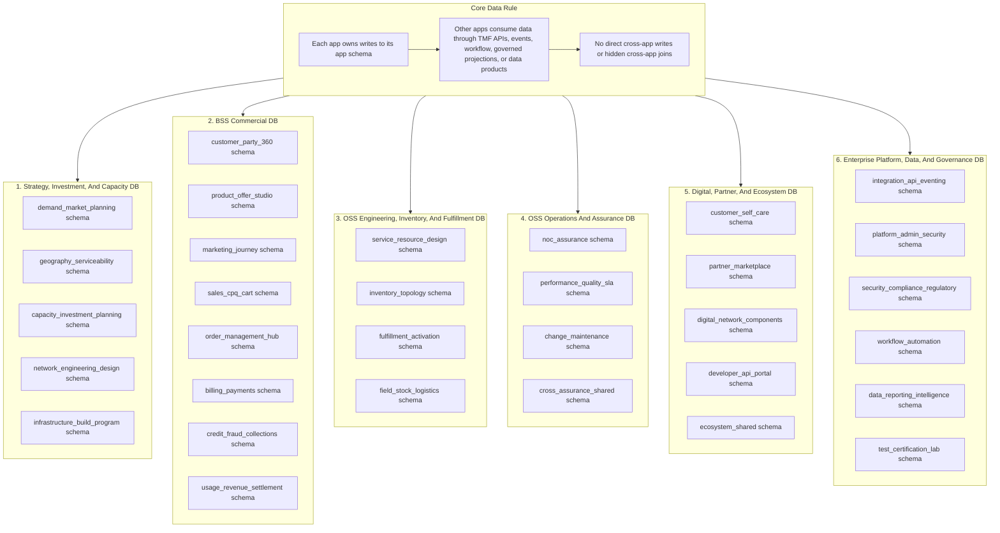

# Recommended Database Setup

This document recommends how many physical databases, app schemas, and logical data groups we should plan for while building the telecom product suite. It is technology-neutral and should be used during application design, backlog creation, API design, environment planning, and deployment planning.

The recommendation follows the suite and data ownership decisions already captured in:

- [API-First Product Suite Architecture](api-first-product-suite-architecture.md)
- [Data Mastery And Entity Ownership](data-mastery-entity-ownership.md)
- [Detailed Suite/App Documents](suite-details/README.md)

## Executive Recommendation

Create **6 physical PostgreSQL databases**, one per product suite, with **app-owned schemas inside each suite database**.

Use this as the default enterprise build target:

| Layer | Recommendation |
| --- | --- |
| Physical databases | 6, one per suite |
| Initial app schemas | 32, one per major app |
| Logical data groups | 37, mapped inside app-owned schemas where module-level separation is useful |
| Data sharing style | APIs, events, workflow tasks, governed read models, data products |
| Direct cross-app operational table access | Not allowed; use APIs, events, governed read-model schemas, workflow tasks, or data products |
| Reporting source | Replicated analytical stores, not operational tables |
| Build principle | Each app owns writes to its own schema and operational data |

The 6-suite-database setup matches the product suite structure, keeps operations practical, and still preserves app ownership through schemas, API boundaries, events, and governed projections.

## Database Boundary Terms

Use these terms consistently:

| Term | Meaning |
| --- | --- |
| Suite database | One physical PostgreSQL database for a product suite, such as BSS Commercial or OSS Operations And Assurance. |
| App schema | A PostgreSQL schema owned by one app or bounded app module inside a suite database. This is the normal write-ownership boundary. |
| Logical data group | A coherent group of tables inside an app schema, such as billing, usage, reservation, or performance data. |
| Database instance or cluster | The operated PostgreSQL runtime boundary that hosts one or more suite databases, with its own scaling, backup, access control, availability, and maintenance plan. |
| Operational master | The app schema or table group that owns authoritative writes for an entity or lifecycle. |
| Read model | A copied, projected, or indexed model created for query, workflow, integration, or reporting. |
| Data product | Governed analytical or shared data output created from operational events, APIs, or approved replication. |

## Recommended Suite Database Layout

The suite-level data model documents provide the authoritative app schema and entity mastery detail:

1. [Strategy, Investment, And Capacity Data Model](suite-details/01-strategy-investment-capacity/data-model.md)
2. [BSS Commercial Data Model](suite-details/02-bss-commercial/data-model.md)
3. [OSS Engineering, Inventory, And Fulfillment Data Model](suite-details/03-oss-engineering-inventory-fulfillment/data-model.md)
4. [OSS Operations And Assurance Data Model](suite-details/04-oss-operations-assurance/data-model.md)
5. [Digital, Partner, And Ecosystem Data Model](suite-details/05-digital-partner-ecosystem/data-model.md)
6. [Enterprise Platform, Data, And Governance Data Model](suite-details/06-enterprise-platform-data-governance/data-model.md)

## Logical Data Group Detail

The sections below preserve the logical data groups from the earlier split-instance model. Under the current recommendation, these are implemented as app schemas or module-level table groups inside the six suite databases. They are not separate physical databases unless a future scale-out decision requires it. Treat the historical `DB` names below as logical group names, not physical database names.

The "Owning app or module area" column uses the exact app names from [Detailed Suite/App Documents](suite-details/README.md). When a logical data group maps to a module inside an app, the module area is shown in parentheses.

### 1. Strategy Planning Logical Group

Recommended logical data groups: **5**

| Logical data group | Primary mastership | Owning app or module area |
| --- | --- | --- |
| Demand Forecast DB | Market demand, forecast scenarios, growth assumptions | Demand And Market Planning |
| Geography, Address, Site DB | Service geography, address zones, candidate sites, coverage areas | Geography, Address, Site, And Serviceability |
| Capacity Planning DB | Capacity models, utilization plans, constraint models | Network Investment And Capacity Planning |
| Network Design DB | Planned network design, design alternatives, BOM intent | Network Engineering And Design |
| Build Program DB | Build initiatives, rollout plans, investment programs | Infrastructure Build Program |

Why keep as a distinct logical group:

- Planning workloads are scenario-heavy and may run long calculations.
- Planning data changes at a different cadence than operational order, inventory, or alarm data.
- Planners need historical scenario comparison without impacting customer or network operations.

### 2. BSS Customer Commercial Logical Group

Recommended logical data groups: **5**

| Logical data group | Primary mastership | Owning app or module area |
| --- | --- | --- |
| Party, Customer, Account, Identity DB | Party, customer, account, contact, billing account links, customer identity references | Customer And Party 360 |
| Product, Offer, Price, Agreement DB | Product catalog, offer catalog, price rules, agreements, contract terms | Product And Offer Studio |
| Segment, Campaign, Journey DB | Segments, campaigns, customer journeys, eligibility intent | Marketing, Campaign, And Customer Journey |
| Qualification, Quote, Cart, Sales DB | Service qualification, product qualification, quote, cart, sales negotiation state | Sales, CPQ, And Cart |
| Product Order DB | Product order lifecycle, order decomposition intent, order status | Order Management Hub |

Why keep as a distinct logical group:

- This is the main commercial engagement and customer order boundary.
- It contains high-value customer and product commercial data.
- It needs strong consistency for quote, contract, order, and account lifecycle.

### 3. BSS Revenue Risk Logical Group

Recommended logical data groups: **3**

| Logical data group | Primary mastership | Owning app or module area |
| --- | --- | --- |
| Bill, Payment, Prepay DB | Bill cycles, invoices, balances, payments, adjustments, prepay state | Billing, Payments, And Account Operations |
| Credit, Fraud, Collections DB | Credit profile, risk cases, fraud investigation, collections lifecycle | Credit, Fraud, And Collections |
| Usage, CDR, Settlement DB | Rated usage, usage records, CDR summaries, partner settlement records | Usage, Charging, And Revenue Settlement |

Why keep as a distinct logical group:

- Revenue workloads require stronger financial controls and auditability.
- Usage and billing volumes can scale differently from customer engagement.
- Fraud, credit, and collections need restricted access and independent retention controls.

### 4. OSS Engineering Fulfillment Logical Group

Recommended logical data groups: **6**

| Logical data group | Primary mastership | Owning app or module area |
| --- | --- | --- |
| Service And Resource Design DB | Service specifications, resource specifications, technical catalog | Service And Resource Design Studio |
| Product, Service, Resource Inventory DB | Installed product, active service, logical resource, physical resource, inventory location binding, actual connectivity path, topology references, operational inventory plan | Inventory And Topology |
| Number, IP, SIM/eSIM, Identifier DB | Number inventory, IP pools, SIM/eSIM resources, identifiers | Inventory And Topology (Numbering, Addressing, And Identifier Resource module) |
| Reservation And Assignment DB | Reservations, allocation state, assignment decisions | Inventory And Topology (Reservation And Assignment module) |
| Fulfillment, Activation, Provisioning DB | Service order, resource order, activation tasks, provisioning state | Fulfillment And Activation Control Tower |
| Field, Stock, Logistics DB | Appointments, workforce tasks, stock, shipment, site visit state | Field Work, Stock, And Logistics |

Why keep as a distinct logical group:

- Inventory and fulfillment are the operational backbone of OSS.
- These logical groups must support accurate service impact, activation, and resource assignment.
- Fulfillment writes should not be slowed by commercial reporting or customer experience workloads.

### 5. OSS Assurance Operations Logical Group

Recommended logical data groups: **6**

| Logical data group | Primary mastership | Owning app or module area |
| --- | --- | --- |
| Alarm And Event DB | Alarms, network events, event correlation state | NOC And Assurance |
| Incident, Service Problem, Ticket DB | Service problems, incidents, trouble tickets, customer-impacting issues | NOC And Assurance |
| Service Test And Diagnostics DB | Test definitions, test results, diagnostics sessions | NOC And Assurance (Service Test And Diagnostics module) |
| Performance, Quality, SLA DB | Performance measurements, quality indicators, SLA state | Performance, Quality, And SLA |
| Change, Maintenance, Risk DB | Change windows, maintenance events, risk assessments | Change And Maintenance Operations |
| Known Error, Remediation, Command Center DB | Known errors, remediation plans, major incident coordination | Cross-Assurance Shared Modules |

Why keep as a distinct logical group:

- Assurance workloads are high-write and event-heavy.
- Fault, alarm, performance, and incident data must remain available during service degradation.
- Operations teams need independent scaling and retention for events, measurements, tickets, and SLA history.

### 6. Digital Partner Ecosystem Logical Group

Recommended logical data groups: **5**

| Logical data group | Primary mastership | Owning app or module area |
| --- | --- | --- |
| Self-Care Experience DB | Customer experience preferences, case views, digital interaction state | Customer Self-Care |
| Partner, Marketplace, Open Gateway DB | Partner profile, partner offers, marketplace listings, gateway productization | Partner And Marketplace |
| IoT, NaaS, Self-Care Component DB | IoT product component state, NaaS component state, reusable digital components | Digital And Network Component Operations |
| Developer Portal, API Subscription DB | Developer accounts, app registrations, API subscriptions, sandbox access | Developer And API Portal |
| Channel, Preference, Notification DB | Channel registry, notification templates, consent, preference state | Ecosystem Shared Modules |

Why keep as a distinct logical group:

- Digital and partner-facing workloads need high read scale and strong external-consumer isolation.
- Most data here should reference BSS/OSS masters instead of becoming duplicate masters.
- Partner, developer, and channel state changes at a different cadence than internal OSS/BSS operations.

### 7. Enterprise Platform Control Logical Group

Recommended logical data groups: **3**

| Logical data group | Primary mastership | Owning app or module area |
| --- | --- | --- |
| Tenant, User, Role, Policy DB | Tenants, users, roles, access policies, delegation models | Platform Admin And Security |
| API Contract, Event Catalog DB | API products, API versions, event contracts, exposure policies | Integration, Eventing, And API Platform |
| Workflow, Rule, Task DB | Workflow definitions, rule definitions, task assignments, process runtime state | Workflow And Automation Studio |

Why keep as a distinct logical group:

- Platform control data affects every suite and must be protected from domain workload spikes.
- API contracts, events, rules, tasks, identity, and tenant controls need strong governance.
- This logical group becomes a control-plane area, not a domain data master for customer, inventory, billing, or assurance entities.

### 8. Security Audit Regulatory Logical Group

Recommended logical data groups: **2**

| Logical data group | Primary mastership | Owning app or module area |
| --- | --- | --- |
| Security, Compliance, Regulatory DB | Security posture, control evidence, regulatory obligations, policy exceptions | Security Operations, Compliance, And Regulatory |
| Audit, Evidence, Retention DB | Audit trails, evidence packages, retention schedules, legal hold records | Security Operations, Compliance, And Regulatory |

Why keep as a distinct logical group:

- Security and audit data must have restricted access, independent retention, and legal hold controls.
- Compliance workloads need immutable evidence patterns and controlled write paths.
- This data should survive app-level incidents and support investigations across all suites.

### 9. Data Intelligence Test Logical Group

Recommended logical data groups: **2**

| Logical data group | Primary mastership | Owning app or module area |
| --- | --- | --- |
| Analytics, Reporting, Data Product DB | Governed data products, semantic models, reporting projections, analytical outputs | Data, Reporting, And Intelligence |
| Test, Environment, Conformance DB | Test assets, certification runs, environment metadata, API conformance results | Test And Certification Lab |

Why keep as a distinct logical group:

- Analytical and test workloads must not create load on operational masters.
- Data products need governed lineage from APIs, events, and approved replication.
- Test and conformance data should be isolated from production operational records.

## Count Summary

| Suite database | Initial app schema count | Logical data group count |
| --- | ---: | ---: |
| Strategy, Investment, And Capacity | 5 | 5 |
| BSS Commercial | 8 | 8 |
| OSS Engineering, Inventory, And Fulfillment | 4 | 6 |
| OSS Operations And Assurance | 4 | 6 |
| Digital, Partner, And Ecosystem | 5 | 5 |
| Enterprise Platform, Data, And Governance | 6 | 7 |
| **Total** | **32** | **37** |

## Environment Recommendation

| Environment | Recommended setup | Purpose |
| --- | --- | --- |
| Local developer | 1 local PostgreSQL runtime can simulate all 6 suite databases and 32 app schemas | Fast local development and contract testing. |
| Shared development | 6 suite databases, lower capacity | Validate app schema ownership boundaries and integration flows early. |
| System integration test | 6 suite databases with production-like naming and access boundaries | Test cross-suite workflows, events, APIs, and rollback behavior. |
| Pre-production | 6 suite databases with production-like backup, restore, security, and observability | Validate release, migration, performance, and operational readiness. |
| Production | 6 highly available suite databases or clusters | Run live telecom operations with controlled suite-level scaling and isolation. |

## Suite Database Standard

The standard build uses **6 suite databases** while preserving app schema boundaries and the **37 logical data groups**:

| Suite database | Included app schemas or logical groups |
| --- | --- |
| Strategy, Investment, And Capacity | All 5 strategy planning app schemas |
| BSS Commercial | All 8 BSS commercial and revenue app schemas |
| OSS Engineering, Inventory, And Fulfillment | 4 app schemas covering 6 logical OSS engineering and fulfillment groups |
| OSS Operations And Assurance | 4 app schemas covering 6 assurance and operations logical groups |
| Digital, Partner, And Ecosystem | All 5 digital and ecosystem app schemas |
| Enterprise Platform, Data, And Governance | 6 app schemas covering 7 platform, security, data, and test logical groups |

This setup is the default for app implementation. Split out physical databases only when volume, compliance, isolation, or operational independence proves the need.

## Future Scale-Out Option

At large operator scale, the 6-suite-database model may split into **9 to 14 physical databases or clusters**. Split only when there is a clear operational reason:

| Split candidate | Split trigger |
| --- | --- |
| Usage, CDR, Settlement DB | Usage volume, mediation load, settlement cycles, retention volume |
| Alarm And Event DB | Alarm/event ingestion rate, correlation load, independent retention |
| Performance, Quality, SLA DB | Time-series volume, long retention, heavy analytics |
| Product, Service, Resource Inventory DB | Large topology graph, high availability requirement, frequent integration reads |
| Audit, Evidence, Retention DB | Regulatory pressure, legal hold, immutable evidence requirements |
| Analytics, Reporting, Data Product DB | Reporting load, AI workloads, data product scale |
| Test, Environment, Conformance DB | Large certification operation or external partner conformance program |

## Data Access Rules

1. Apps write only to their owned app schema or approved table group.
2. Cross-suite reads use APIs, events, workflow tasks, governed read-model schemas, search projections, or governed data products.
3. No app should directly read or write another app operational schema or depend on hidden cross-app joins.
4. Reporting read models and data products must never become hidden operational masters.
5. Replication from operational schemas to analytics must be traceable and governed.
6. Customer, account, billing, usage, inventory, alarm, identity, and audit records need explicit retention rules.
7. Each app schema or logical data group needs a named owning app, data steward, API owner, event owner, and migration owner.

## Naming Convention

Use stable names that make ownership obvious:

| Pattern | Example |
| --- | --- |
| Suite database name | `ts_bss_commercial` |
| App schema name | `billing_payments` |
| Logical data group name | `bill_payment_prepay` |
| Read model database name | `db_rm_customer_order_summary` |
| Analytics data product name | `dp_customer_lifecycle_360` |
| Event stream name | `evt.product_order.v1` |

Recommended suite database and app schema names are defined in the suite-level data model documents. The earlier logical data group names remain useful for module-level table grouping:

| Logical data group family | Historical logical data group names |
| --- | --- |
| Strategy Planning | `db_demand_forecast`, `db_geography_address_site`, `db_capacity_planning`, `db_network_design`, `db_build_program` |
| BSS Customer Commercial | `db_party_customer_account_identity`, `db_product_offer_price_agreement`, `db_segment_campaign_journey`, `db_qualification_quote_cart_sales`, `db_product_order` |
| BSS Revenue Risk | `db_bill_payment_prepay`, `db_credit_fraud_collections`, `db_usage_cdr_settlement` |
| OSS Engineering Fulfillment | `db_service_resource_design`, `db_product_service_resource_inventory`, `db_number_ip_sim_identifier`, `db_reservation_assignment`, `db_fulfillment_activation_provisioning`, `db_field_stock_logistics` |
| OSS Assurance Operations | `db_alarm_event`, `db_incident_problem_ticket`, `db_service_test_diagnostics`, `db_performance_quality_sla`, `db_change_maintenance_risk`, `db_known_error_remediation_command_center` |
| Digital Partner Ecosystem | `db_selfcare_experience`, `db_partner_marketplace_open_gateway`, `db_iot_naas_selfcare_component`, `db_developer_portal_api_subscription`, `db_channel_preference_notification` |
| Enterprise Platform Control | `db_tenant_user_role_policy`, `db_api_contract_event_catalog`, `db_workflow_rule_task` |
| Security Audit Regulatory | `db_security_compliance_regulatory`, `db_audit_evidence_retention` |
| Data Intelligence Test | `db_analytics_reporting_data_product`, `db_test_environment_conformance` |

## Backup, Restore, And Retention Guidance

| Suite database or scale-out group | Backup and restore priority | Retention notes |
| --- | --- | --- |
| Strategy Planning | Medium | Keep scenario history and planning baselines. |
| BSS Customer Commercial | High | Retain customer, contract, order, and account records according to commercial and privacy policy. |
| BSS Revenue Risk | Very high | Retain billing, usage, payment, fraud, and settlement records according to financial and regulatory policy. |
| OSS Engineering Fulfillment | High | Retain inventory and activation history needed for service reconstruction and disputes. |
| OSS Assurance Operations | High | Retention differs by data type: events may be shorter, incidents and SLA history may be longer. |
| Digital Partner Ecosystem | Medium to high | Retain partner, consent, notification, and API subscription state according to contract and privacy policy. |
| Enterprise Platform Control | Very high | Identity, workflow, and API contract history must support audit and rollback. |
| Security Audit Regulatory | Critical | Use restricted access, immutability where required, legal hold, and evidence retention. |
| Data Intelligence Test | Medium | Data products need lineage; test data should be sanitized and lifecycle-managed. |

## Build Sequence Recommendation

Create the suite databases and app schemas in the same order as the foundational product build:

1. Enterprise Platform, Data, And Governance DB, starting with platform admin, security, API/eventing, and workflow schemas.
2. BSS Commercial DB, starting with Customer And Party 360 and Product And Offer Studio schemas.
3. OSS Engineering, Inventory, And Fulfillment DB, starting with service/resource design and inventory/topology schemas.
4. OSS Operations And Assurance DB, starting with NOC/assurance and performance/SLA schemas.
5. Digital, Partner, And Ecosystem DB, starting with ecosystem shared modules and customer self-care schemas.
6. Strategy, Investment, And Capacity DB, starting with geography/serviceability and demand/capacity schemas.

This order supports identity, API contracts, workflow, customer, catalog, order, inventory, fulfillment, assurance, digital channels, planning, and analytics in a practical sequence.

## Decision Rules For Splitting Or Combining

Split an app schema or logical data group into its own physical database when at least two of these are true:

- It has much higher write volume than neighboring databases.
- It needs stricter access control or audit controls.
- It has different backup, restore, or retention rules.
- It needs independent scaling or maintenance windows.
- It is on the critical path for live network operations or revenue operations.
- It has noisy analytical workloads that can affect operational transactions.
- It is owned by a separate team with a separate release lifecycle.

Keep app schemas combined inside one suite database only when all of these remain true:

- Each app still owns its own schema and write model.
- Backup and restore plans do not create unacceptable blast radius.
- Access control prevents accidental cross-app access.
- Operational load patterns are similar.
- The combination is reversible when scale or compliance requires separation.

## Final Recommended Position

For this telecom product suite, the build should plan for:

- **6 physical PostgreSQL suite databases**
- **32 initial app-owned schemas**
- **37 logical data groups mapped inside app schemas where useful**
- **9 to 14 physical databases later only when volume, compliance, or independent scaling proves the need**

This gives us clean data ownership and a practical implementation path while keeping the architecture aligned to TM Forum API-first principles.
